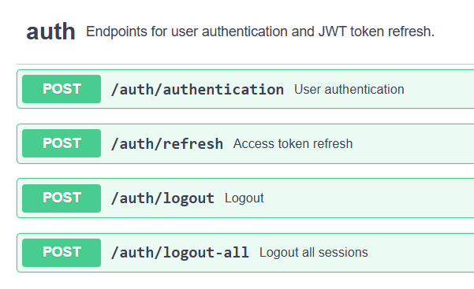
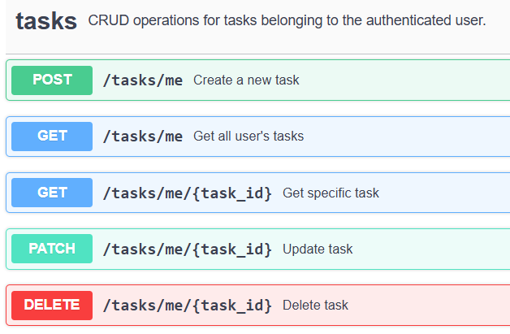
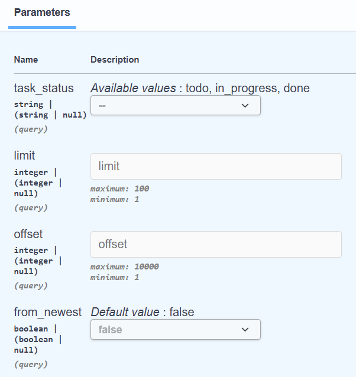

# ToDo Service Backend API

> Production-oriented REST API for task and user management,
> built with FastAPI, PostgreSQL, Redis, RabbitMQ, and Celery.

[](https://www.python.org/)
[](https://fastapi.tiangolo.com/)
[](https://www.postgresql.org/)
[](https://redis.io/)
[](https://www.rabbitmq.com/)
[](https://docs.celeryq.dev/)
[](https://www.sqlalchemy.org/)
[](https://alembic.sqlalchemy.org/)
[](https://pytest.org/)
[](https://www.docker.com/)
[](https://git-scm.com/)

**API Version:** 0.5.2

---

## Overview

ToDo Service is a production-oriented REST API for task and user management,
built with FastAPI and PostgreSQL.

The project demonstrates:

- Clean Architecture and dependency inversion
- JWT authentication with refresh-token rotation and reuse detection
- Redis caching and distributed rate limiting
- Asynchronous background processing with Celery and RabbitMQ
- Periodic task scheduling with Celery Beat
- Automated testing and structured observability
- Docker-based development and deployment

### Main Capabilities

- User registration and account management
- JWT authentication and session management
- Role-Based Access Control (RBAC)
- Task management with filtering and pagination
- Administrative user and task management
- Redis caching and rate limiting
- Asynchronous welcome email delivery
- Periodic expired-token cleanup
---

## Contents

- [Overview](#overview)
- [Features](#features)
- [Architecture](#architecture)
- [Database Design](#database-design)
- [Authentication Flow](#authentication-flow)
- [API](#api)
- [Configuration](#configuration)
- [Running the Project](#running-the-project)
- [Testing](#testing)
- [Documentation](#documentation)
- [License](#license)

---

## Engineering Highlights

| Area             | Implementation                                                             |
| ---------------- | -------------------------------------------------------------------------- |
| Architecture     | Clean Architecture, Repository Pattern, Dependency Injection, Unit of Work |
| Authentication   | JWT access/refresh tokens, rotation, reuse detection                       |
| Authorization    | Role-Based Access Control (RBAC)                                           |
| Database         | PostgreSQL, SQLAlchemy 2.0, Alembic migrations                             |
| Caching          | Redis-based application caching                                            |
| Rate Limiting    | Redis sliding window log and counter algorithms                            |
| Async Processing | Celery workers with RabbitMQ as the message broker                         |
| Scheduling       | Celery Beat for periodic task scheduling                                   |
| Reliability      | Automatic retries, exponential backoff, retry jitter, late acknowledgments |
| Transactions     | Unit of Work with centralized commit/rollback                              |
| Observability    | Structured JSON logging, correlation IDs, request timing                   |
| Security         | bcrypt, refresh token hashing, ownership checks, security headers, HSTS    |
| Testing          | Unit, repository, API/integration, and infrastructure tests                |
| Infrastructure   | Docker, Docker Compose, multi-stage builds                                 |

---

## Features

### Authentication & Authorization

- User registration and authentication
- JWT access and refresh tokens
- Refresh token rotation and reuse detection
- Session revocation and logout
- Role-Based Access Control (RBAC)

### User Management

- Account information retrieval and updates
- Password changes with previous-password verification
- Account deletion
- Account activation and deactivation

### Task Management

- Create, update, retrieve, and delete tasks
- Task status management
- Ownership enforcement
- Filtering and pagination

### Administration

- User listing and search
- User blocking and unblocking
- Role management
- Administrative task management

### Security

- bcrypt password hashing
- Hashed refresh tokens
- Resource ownership enforcement
- Security headers
- CORS configuration
- Request validation

### Observability

- Health checks
- Database and Redis connectivity checks
- Structured JSON logging
- Correlation IDs
- Request duration tracking

### Background Processing

- Asynchronous welcome email delivery
- Redis-based idempotency for welcome email delivery
- Automatic task retries with backoff and jitter
- Periodic expired refresh-token cleanup
- Celery workers and Celery Beat
---


## Architecture

The application is divided into four main layers:

* **Domain** — entities, value objects, domain exceptions, and interfaces
* **Application** — use cases, services, and DTOs
* **Infrastructure** — database, repositories, security, Redis (caching and rate limiting), Celery, RabbitMQ, and Unit of Work implementation
* **Presentation** — FastAPI routers, schemas, dependencies, middleware, and exception handlers

Dependencies point toward the domain layer, while infrastructure-specific implementations are injected through interfaces and dependencies.

### For more detailed information, see **[docs/architecture.md](docs/architecture.md)**.

---

## Middleware

The API uses middleware for cross-cutting HTTP concerns:

* **Correlation ID** — assigns a unique identifier to each request
* **Request Logging** — records HTTP requests and response duration
* **Security Headers** — adds security-related HTTP headers
* **CORS** — controls allowed cross-origin requests

Middleware is configured in:

```text
app/presentation/api/middleware/setup.py
```

---

## Database

The service uses PostgreSQL with SQLAlchemy 2.0, and schema changes
are managed through Alembic migrations.

Core entities:

- **Users** — accounts, authentication, and roles
- **Tasks** — user-owned tasks with status tracking
- **Refresh Tokens** — hashed rotating tokens with family tracking
- **Roles** — RBAC role definitions

### Detailed schema definitions are available in the **[docs/database.md](docs/database.md)**.

---

## Authentication Flow

The system uses short-lived JWT access tokens and rotating refresh tokens.

Refresh tokens are stored as SHA-256 hashes and rotated on every use.
Reuse of a revoked token invalidates the entire token family.

### Detailed information and refresh token lifecycle is available in the **[docs/authentication.md](docs/authentication.md)**.

---

## API

The service provides REST endpoints for:

- Authentication and session management
- User management
- Task management
- Administrative operations
- Health monitoring

Interactive documentation:

- Swagger UI: `/docs`
- ReDoc: `/redoc`

Examples: 






### For complete endpoint documentation, request/response examples, filters, pagination, and response formats, see **[docs/api.md](docs/api.md)**.

---

## Documentation

| Document | Description |
|----------|-------------|
| [Architecture](docs/architecture.md) | Application architecture and design principles |
| [Authentication](docs/authentication.md) | JWT and refresh-token lifecycle |
| [Database](docs/database.md) | Database schema and relationships |
| [API](docs/api.md) | API endpoints and usage |
| [Running](docs/running.md) | Development and deployment instructions |
| [Testing](docs/testing.md) | Testing strategy and test execution |

---

## Configuration

The application uses environment-based configuration with Pydantic Settings.

The `ENVIRONMENT` variable controls which `.env` file is loaded:

| Environment | File        |
| ----------- | ----------- |
| `local`     | `.env`      |
| `dev`       | `.env.dev`  |
| `prod`      | `.env.prod` |

In `app/core/config.py`, `local` is used as the default environment.

---

## Running the Project

The project supports three execution modes:

* **Docker DEV** — local development with hot reload and bind mounts
* **Docker PROD** — production-oriented container configuration
* **Manual Setup** — run the application without Docker

### Quick Start

Clone the repository:

```bash
git clone https://github.com/SeVeR04eK/ToDo_service.git
cd ToDo_service
```

Generate a secret key:

```bash
python -c "import secrets; print(secrets.token_hex(32))"
```

Configure `.env.dev` and replace the default `SECRET_KEY` with the generated value.

Start the development environment:

```bash
docker compose -f docker-compose.dev.yml up --build
```

The development environment starts:

* FastAPI
* PostgreSQL
* Redis
* RabbitMQ
* Celery Worker
* Celery Beat

Database migrations and development seed scripts are executed automatically.

### Services

| Service                | Address                       |
| ---------------------- | ----------------------------- |
| Swagger UI             | `http://127.0.0.1:8000/docs`  |
| ReDoc                  | `http://127.0.0.1:8000/redoc` |
| PostgreSQL             | `localhost:5432`              |
| Redis                  | `localhost:6379`              |
| RabbitMQ Management UI | `http://127.0.0.1:15672`      |

When running with Docker Compose, use the service names `db` and `redis` as hostnames inside the application configuration instead of `localhost`.

### Environment Configuration

The `ENVIRONMENT` variable determines which configuration file is loaded:

| Environment | Configuration |
| ----------- | ------------- |
| `local`     | `.env`        |
| `dev`       | `.env.dev`    |
| `prod`      | `.env.prod`   |

The default environment is `local`.

### Stopping the Development Environment

```bash
docker compose -f docker-compose.dev.yml down
```

To remove the database volume as well:

```bash
docker compose -f docker-compose.dev.yml down -v
```

### Detailed instructions for Docker PROD, manual installation, environment variables, database setup, migrations, and deployment are available in **[docs/running.md](docs/running.md)**.

---

## Testing

The project includes tests for API endpoints, services, repositories,
use cases, and Celery background tasks.

### Running Tests

```bash
pytest
```

With coverage:

```bash
pytest --cov=app --cov-report=html
```

### Test Structure

```text
tests/
├── api/             # API integration tests
├── infrastructure/  # Infrastructure tests
├── services/        # Unit tests with mocked dependencies
├── repositories/    # Database integration tests
└── use_cases/      # Business logic tests
```

### CI

Every push and pull request runs:

* Automated tests
* Application checks
* Docker build verification

### For more details, see **[docs/testing.md](docs/testing.md)**.

---

## License

MIT License